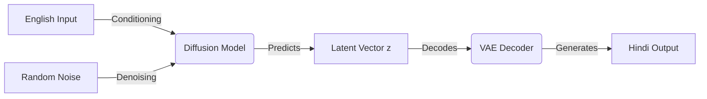

#  Hindi-Planner: Latent Diffusion for Machine Translation

> **A Research Prototype implementing Latent Diffusion for English-to-Hindi Translation.**
> *Built from scratch in PyTorch | Containerized with Docker | Served via FastAPI*

---

##  Overview

**Hindi-Planner** is an experimental Neural Machine Translation (NMT) system that moves beyond standard Transformer-based translation. Instead of predicting tokens autoregressively from the start, it treats translation as a **Conditional Generation** problem using **Latent Diffusion**.

The model "dreams" up a semantic vector (thought) representing the Hindi meaning from the English input, and then decodes that vector into text.

###  Architecture

The system consists of two distinct stages trained separately:

1.  **The Body (VAE):** A Variational Autoencoder trained on 1.6M Hindi sentences. It learns to compress Hindi text into a dense latent vector ($z$).
2.  **The Brain (Diffusion Prior):** A conditional diffusion model that learns to predict these latent vectors ($z$) given an English sentence embedding.

## Features
1. Custom VAE Implementation: Built a Transformer-based VAE with KL-Annealing to prevent posterior collapse.

2. Latent Diffusion: Implemented a continuous diffusion process (DDPM style) to map English embeddings to Hindi latent space.

3. Production Engineering:

    a. Full MLOps pipeline from data streaming to inference.

    b. Dockerized microservice architecture.

    c.FastAPI wrapper for real-time inference.

4. Optimized Training:

    a. Supports Mixed Precision (AMP) for CUDA.
    
    b. Optimized for Apple Silicon (MPS) acceleration.
    
    c. Gradient Accumulation for effective large-batch training.

## Installation & Usage

Option A: Run via Docker (Recommended)
This ensures the environment is exactly as intended, regardless of your OS.
# 1. Build the Container (Takes ~3-5 mins to copy checkpoints)
docker build -t hindi-planner .

# 2. Run the Container
docker run -p 8000:8000 hindi-planner

Option B: Local Development
Prerequisites: Python 3.10+
# 1. Install Dependencies
pip install -r requirements.txt

# 2. Run the Server
python -m src.app

## API Refrence
Once running, you can interact with the model via Swagger UI or programmatically.

Endpoint: POST /translate

// Request
{
  "text": "Machine learning is interesting"
}
// Response
{
  "input": "Machine learning is interesting",
  "translation": "मशीन लर्निंग दिलचस्प है",
  "model_version": "v1-diffusion"
}

## Experiments 
1. Posterior Collapse: Initially, the VAE ignored the latent vector. Solved by implementing Cyclical KL Annealing and aggressive dropout.

2. Mode Collapse: The diffusion model occasionally got stuck in loops ("Map Map Map"). Addressed using Temperature Sampling and Repetition Penalties during the VAE decoding phase.

3. Hardware Constraints: Trained on constrained compute (Apple M-Series / Single GPU) using Gradient Accumulation and Int32 tensor optimizations.
